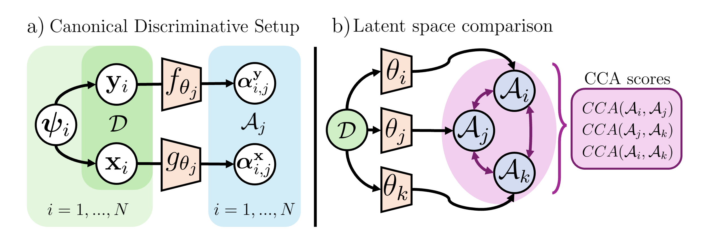

# Astro-ML-Peek

*By: Noé Dia, Salma Salhi, Gabriel Missael Barco*

A repository storing experiments for the final project in the class IFT 6168: Causal Inference and Machine Learning given by Professor Dhanya Sridhar at MILA.

We explore the linear identifiability of different models that fit within the Canonical Discriminative Form described by Roeder et al. (2020) in their paper *On Linear Identifiability of Learned Representations*, including AstroCLIP (Parker et al., 2024).

## References

- *Roeder, G., Metz, L., & Kingma, D. (18--24 Jul 2021). On Linear Identifiability of Learned Representations. In M. Meila & T. Zhang (Eds), Proceedings of the 38th International Conference on Machine Learning (pp. 9030–9039). Retrieved from https://proceedings.mlr.press/v139/roeder21a.html*
- *Parker, L., Lanusse, F., Golkar, S., Sarra, L., Cranmer, M., Bietti, A., … Polymathic AI Collaboration. (2024). AstroCLIP: a cross-modal foundation model for galaxies. Monthly Notices of the Royal Astronomical Society, 531(4), 4990–5011. doi:10.1093/mnras/stae1450*
